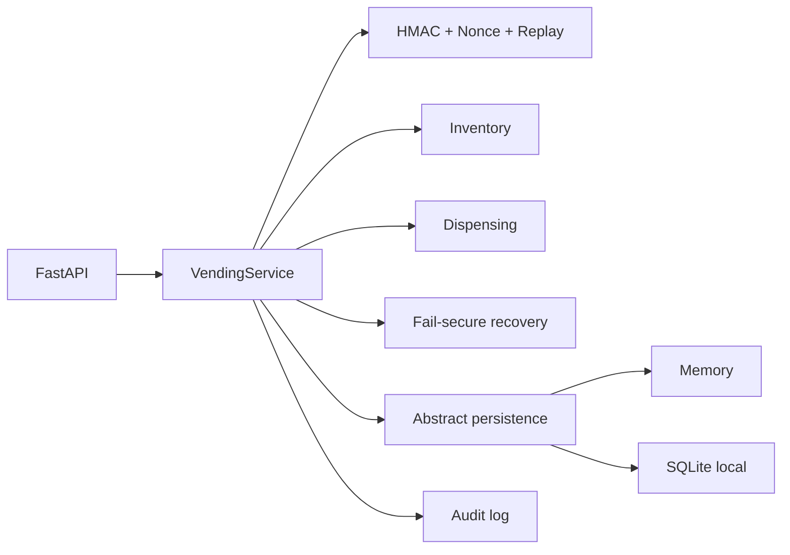
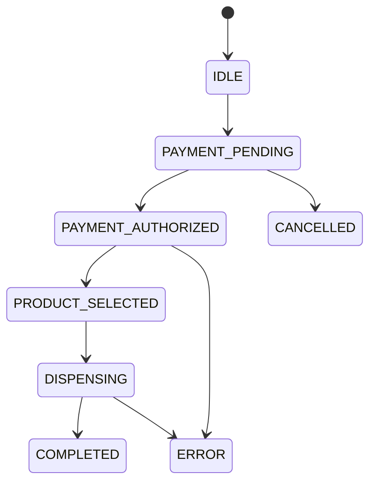

# Lab IoT Defensive: simulated vending machine

Machine Vending Lab is a local security-focused IoT vending machine simulation designed to explore defensive controls in a realistic but fully isolated environment. It models a complete purchase flow with secure state transitions, inventory validation, replay protection, fail-secure recovery and structured audit logging.

The project is built for learning, testing and experimentation in a controlled setting without connecting to real hardware, commercial payment systems or production networks.

## Scope and required boundaries

- Everything runs only locally against an internal simulator.
- It does not include offensive payloads, malware, trojans, reverse shells or exploitation techniques.
- It is not tested against real vending machines, commercial payment readers real cards, household networks or third-party equipment.
- Data and transactions are fully fictional.

For more detail, see `docs/ethical-scope.md`.

## Project structure

```text
app/
  api/
  domain/
  security/
  services/
  devices/
  storage/
  audit/
tests/
scenarios/
docs/
reports/
scripts/
```

## Architecture



## State machine



Implemented states: `IDLE`, `PAYMENT_PENDING`, `PAYMENT_AUTHORIZED`, `PRODUCT_SELECTED`, `DISPENSING`, `COMPLETED`, `CANCELLED`, `ERROR`.

## Security controls implemented

- Configurable HMAC-SHA256 signing via `HMAC_SECRET`.
- Single-use nonce validation with expiration to protect against replay attacks.
- Rejection of duplicate, tampered, out-of-order, expired and incorrect-amount messages.
- Rejection of nonexistent products and out of stock items.
- Timeouts, disconnects, resets and interrupts handled with fail-secure behavior.
- Structured audit logging without exposing secrets.

## Configuration

1. Create a virtual environment and install dependencies:

```bash
python -m venv .venv
source .venv/bin/activate
pip install -r requirements.txt
```

2. Set up environment variables:

```bash
cp .env.example .env
```

## Run locally

```bash
uvicorn app.main:app --host 0.0.0.0 --port 8000
```

Health check:

```bash
curl http://127.0.0.1:8000/health
```

## Tests

```bash
pytest -q
```

## Safe scenarios

```bash
python -m scenarios.run_all
```

Included scenarios:
- normal flow,
- replay attack,
- tampering,
- invalid amount,
- invalid order,
- timeout,
- disconnect,
- restart.

## Docker

Build:

```bash
docker build -t vending-iot-lab .
```

Compose (localhost only):

```bash
docker compose up --build
```

The service is limited to `127.0.0.1:8000` in `docker-compose.yml`.

## Makefile

```bash
make install
make test
make run
make scenarios
make demo
make reset
make export-audit
```

## Main API

- `GET /health`
- `GET /machine/state`
- `GET /machine/inventory`
- `POST /transactions`
- `POST /transactions/{transaction_id}/payment`
- `POST /transactions/{transaction_id}/select`
- `POST /transactions/{transaction_id}/dispense`
- `POST /transactions/{transaction_id}/cancel`
- `POST /transactions/{transaction_id}/timeout`
- `POST /transactions/{transaction_id}/disconnect`
- `POST /transactions/{transaction_id}/restart`
- `POST /transactions/{transaction_id}/interrupt`
- `GET /audit`

## Threat model, controls, and experiments

- `docs/threat-model.md`
- `docs/security-controls.md`
- `docs/experiments.md`
- `docs/hardware-integration.md`
- `docs/example-results.md`

## Future integration with ESP32 / Raspberry Pi

This is supported through `app/devices/device_adapter.py` while preserving cryptographic controls and state validation. There is no connection to commercial readers during this laboratory simulation.

---

If you found this project interesting, please give it a star ⭐ Thx!!!


