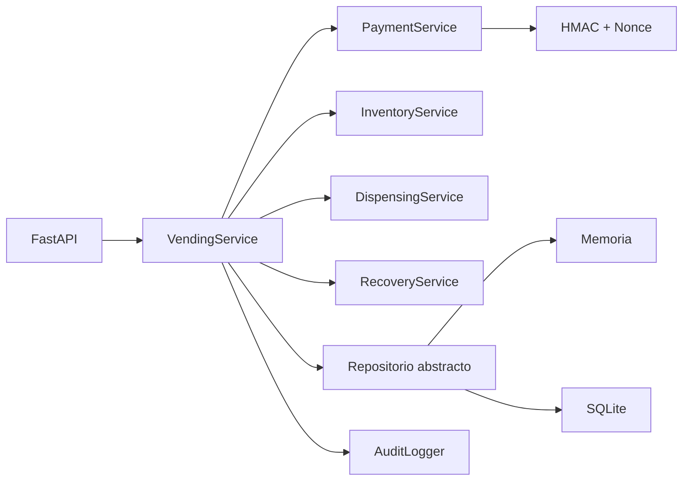

# Arquitectura

Este laboratorio implementa un diseño defensivo y local.

```mermaid
flowchart LR
  API[FastAPI] --> VS[VendingService]
  VS --> PS[PaymentService]
  VS --> IS[InventoryService]
  VS --> DS[DispensingService]
  VS --> RS[RecoveryService]
  PS --> HMAC[HMAC + Nonce]
  VS --> REPO[Repositorio abstracto]
  REPO --> MEM[Memoria]
  REPO --> SQL[SQLite]
  VS --> AUD[AuditLogger]
```
