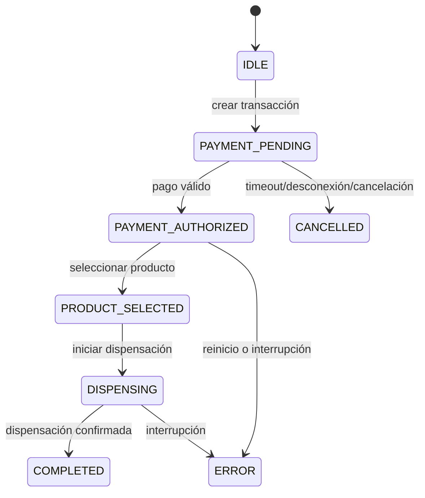

# Máquina de estados

Estados implementados:
IDLE, PAYMENT_PENDING, PAYMENT_AUTHORIZED, PRODUCT_SELECTED, DISPENSING, COMPLETED, CANCELLED, ERROR.

```mermaid
stateDiagram-v2
  [*] --> IDLE
  IDLE --> PAYMENT_PENDING: crear transacción
  PAYMENT_PENDING --> PAYMENT_AUTHORIZED: pago válido
  PAYMENT_AUTHORIZED --> PRODUCT_SELECTED: seleccionar producto
  PRODUCT_SELECTED --> DISPENSING: iniciar dispensación
  DISPENSING --> COMPLETED: dispensación confirmada
  PAYMENT_PENDING --> CANCELLED: timeout/desconexión/cancelación
  PAYMENT_AUTHORIZED --> ERROR: reinicio o interrupción
  DISPENSING --> ERROR: interrupción
```
